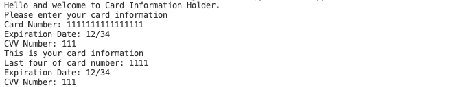

# helloWorld
## Overview
This program allows the Users card information to be entered and saved for future use.
## Development Environment
* VS Code
* Python 3.8.5

## Execution
To run put: 
```python
python3 info.py
``` 
Information should then be entered into the program.
The ouput is like this:   


## Useful Websites

*[Here](https://stackoverflow.com) is Stack Overflow that helped me with this project.